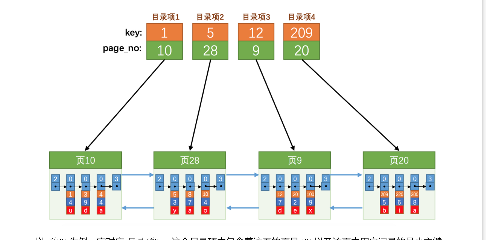
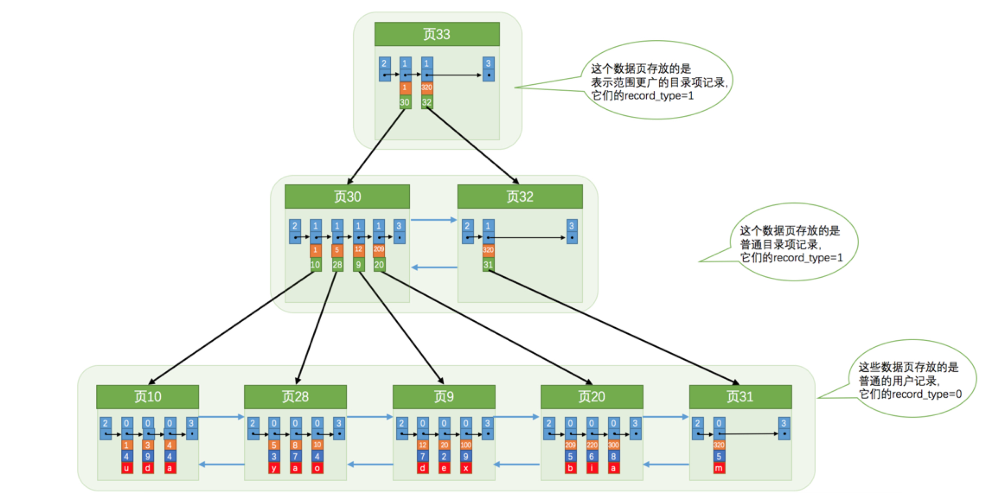

# 索引
## 解决的问题  查记录效率低
### 单页查找
```sql
select * from user where id = 1
```
对于这条查询语句，由于是主键作为筛选条件，所以，可以利用页目录，使用二分法查找页目录。然后在单个槽中查找该槽中的主键。

``` sql
select * from user where name = "王五"
```
对于这条sql语句，没有针对name属性的页目录，只能挨个遍历。

### 多页查找
当一个表中的数据被放在多个页里面时，要查找数据，只能挨个遍历所有的数据页，以及数据页里的记录。

而且多个数据页并不一定时挨着的，数据页是通过双向链表链接起来的，磁盘io花费时间更多，遍历花费时间更长。

## 解决多页查找问题  建立索引(类似页目录)

### 一句话总结
将所有的页按照主键大小，从小到大排序。
数据页有序了，就可以建立目录。
查找记录时，通过索引（目录）二分查找数据页，查询到具体的页，再通过槽二分查找记录。

### 排序
前一个数据页的主键值必须小于下一数据页的主键值（有序）

### 建立目录

使用InnoDB数据页结构来构建索引，普通的数据页存放的就是用户放入的普通记录，而构建索引的数据页存放的记录是目录项记录，他的record_type为1，标识该记录是索引，而不是普通记录。一个目录项记录只存放两列，当前目录项记录对应的数据页的页号，以及该页主键的最大值。



### 目录扩展
当记录的数据变多，可以通过在索引数据页中添加目录项记录的方式添加索引。
目录项记录太多，查找效率低，也可以通过为目录项建立目录（索引）的方式 优化查询
这样，索引结构就是一颗B+树。




## 索引的类型
### 聚簇索引
- 是一颗B+树
- 使用主键值作为数据的排序依据
- 叶子节点存放完整的数据记录。
### 二级索引
- 是一颗B+树
- 使用自定义的值作为数据的排序依据
- 叶子节点存放自定义的值和主键值
- 需要回表格
- 自定义的值可能不唯一，找到第一个后，只需要沿着页中的单链表遍历，直到不是要查找的值为止。

### 联合索引
- 是一颗B+树
- 使用定义的多个列作为数据的排序依据，比如C1，C3列，排序时，先按照C1排序，C1相同，再按照C3排序
- 叶子节点存放自定义的多个列的值和主键值
 
