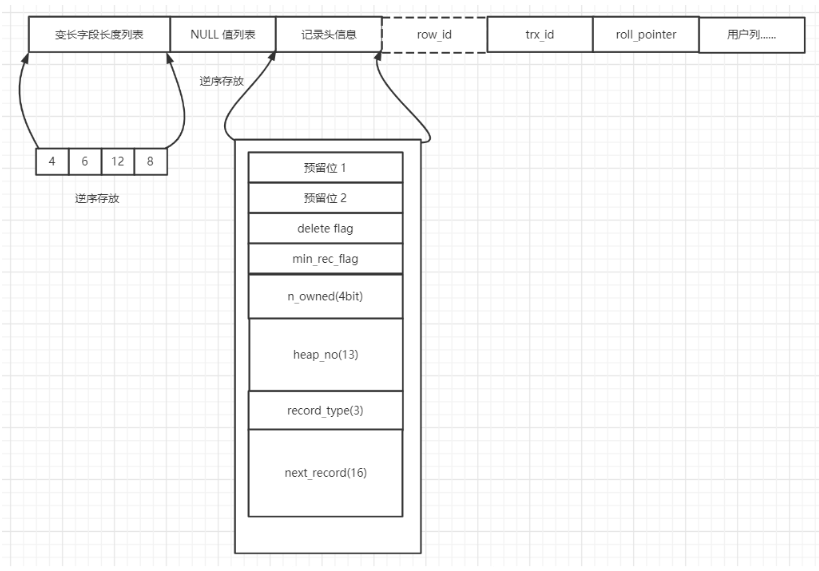
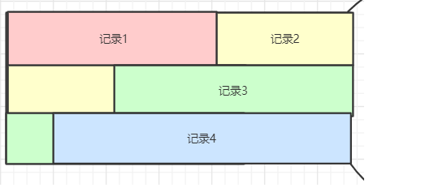
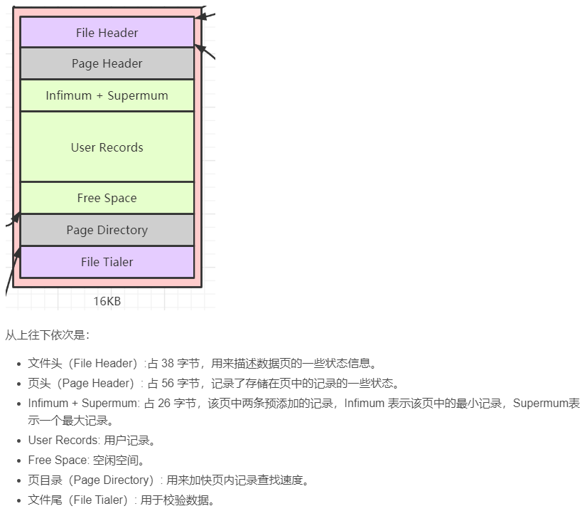

## 设计理念
Mysql把与真实数据无关的操作放在Service层，与数据相关的操作交给存储引擎(表处理器)

## 读取一条记录
Service 服务层
建立数据库连接 -> 连接器
查询缓存
分析sql语句 -> 词法分析 语法分析
对语句进行优化 -> 优化器 得到执行计划
结果数据库此时已经知道应该对什么做什么。

存储引擎
磁盘速度慢，数据是在内存处理的，那么数据怎么被拿到内存中？
InnoDB存储引擎对数据分页，一页一页的拿，一页是16K

页里面存的什么？

##  InnoDB行格式

COMPACT 格式

-  变长字段长度列表
    - 数据库中有变长数据类型，长度不固定，这里读取的时候，InnoDB行存储记录时需要存储变长子u但长度
- NUll值列表
    - 对于一条记录中的null字段，存储null值只需要表示当前位是否为null就可以，不需要开辟null值属性的类型所需的空间，所以单独拿出来记录。
- 记录头信息
    - 不想知道
- row_id
    - 行id，不必需要
        - 如果用户没有自定义主键，而且属性中也没有不允许为null的UNIQUE键，就会创建这个字段作为主键，
- trx_id
    - 事务id
- roll_pointer
    - 回滚指针

- 记录头信息 
    - delete flag
        - 为0当前节点未被删除，为1当前节点被删除。
        - 被删除的节点会被加入垃圾链表中，等待复用。
    - min_rec_flag
        - B+树每层非叶子节点中的最小的目录项记录都会添加该标记
    - n_owned
        - 分组的最后一条记录存储的是分组的记录数，其余记录存储0
        - 解决问题 
            -  查询某一条记录，需要遍历记录构成的单链表，太慢了
        - 方案  
            -  将用户的所有记录分组，在页尾部存储分组的最后一条记录到0字节的偏移量，称之为槽，一个槽为2字节。要查找一条特定记录，只需要根据主键，进行二分查找，查找到是在特定槽，就只需要在该槽的分组中查找记录，大大提高性能。这个槽就是页目录。
        - 分组方案
            - Infimum记录只能自己作为一组
            - Supermum所在分组数量为 1-8
            - 其他分组数量为 4-8
    - heap_no
        -  
        - 存储的记录是紧紧挨着的，所有的记录被称为一个堆，heap_no就是当前记录在堆中的序号。但是堆的0序号存储的是最小记录(Infimum记录)，1序号最大记录(Supermum记录)
        - 记录的大小是记录的主键大小，根据规定最大的是最大记录，最小的是最小记录。

    - record_type
        - 0 普通记录
        - 1 B+树非叶子节点的目录项记录  索引的记录
        - 2 Infimum记录
        - 3 Supermun记录
    - next_record
        - 指向的是下一条记录，是当前主键的下一条记录，也就是说记录存储形式不是数组，而是单向链表，链表的头节点是最小记录，尾节点是最大记录。
        - 删除记录，只要在单链表中将被删除记录的前一个next_record指针指向下下个节点，但是该条记录的存储空间不会释放，一旦释放，会导致重新排列其他记录，浪费。

## InnoDB页结构
InnoDB存储引擎有许多的页结构，但我们只关注存储数据的页结构，数据页
### 数据页结构

一个崭新的页是没有User Records记录字段的，之后每添加一条记录，就会向Free Space申请一份空间作为User Records，当Free Space用完后，就会申请下一页。

**页面头**

存储数据页中记录的状态信息，比如有多少个数据，Free Space还有多少空间，页目录存了多少槽。

**文件头部**
页的通用信息，比如当前页的编号、上一个页是哪个、下一个页是哪个，各个数据页可以组成一个双向链表

**文件尾部**
负责检验当前页是否完整、保证页的数据完整性。

