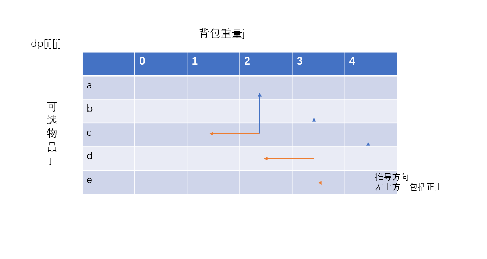
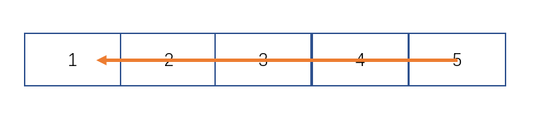

# 动态规划
重点是找到状态转移方程

要理解一个动态规划算法，重点是掌握填充动态规划数组的过程。
怎么初始化，下一个状态怎么由前面的状态推出，填充的顺序是什么

## 做题步骤
- 判断题目是否是特定类型，如果是，套框架。
* 确定dp数组定义
* 推导状态转移方程
- 初始化dp数组

# 问题类型

## 0/1背包问题
### 套用说明
符合01背包问题的都是从一组数中，做出的选择是把这一组数装入或者不装入背包，至于背包存放的值是什么，视具体情况而定。
也就是套的时候不能直接套dp数组存的数据含义。

### 问题描述
从一堆数里面选出几个数，选出最能满足题意的最大值。
比如由一个容量为n的背包，现在有一堆物品，他们的重量价值不同，应该放哪些物品，才能让背包里的物品价值和最大？

### dp数组定义
dp[i][j]   
从i个数中取，放入容量为j的背包里，得到的最大价值为

### dp数组定义技巧
比如从3个数中选出和为5的背包问题
建议定义dp数组为dp[3 + 1][5 + 1];
也就是定义的时候dp[n + 1][target + 1]
也就是考虑了一个数不选和背包为空的情况，这样会少特别多bug

### 递推公式
01背包的递推公式为：
``` java
if (j - weight[i] >= 0) {
    dp[i][j] = Math.max(dp[i - 1][j], dp[i - 1][j - weight[i]] + value[i]);
} else {
    dp[i][j] = dp[i - 1][j]
}

```


### 图解

.png)

背包问题本质上就是填充这个二维数组。

### 推导顺序
每个节点有左上方节点推导而来。

根据状态转移方程来看，
dp[i][j] = Math.max(dp[i - 1][j], dp[i - 1][j - weight[i]] + value[i]); 当前状态时由上一行的正上方状态或者正上方状态前面的状态推导而来。


### 初始化
- 核心思想
    - 设置好下面两个值。 

- 循环开始时推导第一行值所必须的数据。
    - 根据上面的推导顺序，当前节点是由正上方节点以及其之前的节点推导出来的，也就是，初始化时，必须把该节点正上方及之前的数据进行初始化。
- 为被推导节点的初始化值（目的是保证初始化的值不会影响到状态转移方程的推导）
    - 要根据递推公式进行设置，这里由于是完全由上一层节点推出，与当前节点无关，也就不需要初始化

### 两次for循环可以颠倒顺序嘛
可以
- **核心思想**
根据递推表达式来判断，设置当前节点时，是否所需要的节点全部被设置好。

- 先遍历物品
    - 先遍历物品，也就是一行一行的遍历，设置节点时，它的上一行的所有节点肯定全部设置。所以可以正常遍历。
- 先遍历容量
    - 也就是一列一列的遍历，由于递推公式中，当前节点是由正上方节点以及其之前的节点推导出来的，设置节点时，前面所有列以及当前列的上面的节点以及设置好。也就是正好设置了正上方节点以及其之前的节点。


## 0/1背包问题一维滚动数组
### 设计思想
每加入一个物品，不新开一行，选择当前行更新数据，也就把二维压缩到了一维。

ps：
仍然保留了for i循环 也就是仍然遍历可选元素次，但是每次都在重复利用那一行，在上面滚动更新数据。

### dp数组定义
dp[j]   
放入容量为j的背包里，得到的最大价值为

### dp数组定义技巧
比如从3个数中选出和为5的背包问题
循环3次，每加入一个数，滚动更新一次数据。
然后建议定义dp数组为dp[5 + 1];
也就是定义的时候dp[target + 1]
也就是考虑了背包为空的情况，这样会少特别多bug

### 递推公式
01背包的递推公式为：
``` java
if (j - weight[i] >= 0) {
    dp[j] = Math.max([j - 1], dp[j - weight[i]] + value[i]);
} else {
    dp[j] = [j]
}

```


### 图解

.png)

背包问题滚动一维数组，本质上就是执行可选物品次数的循环，每次循环更新一次这个数组。

### 推导顺序
每个节点有左上方节点推导而来。

根据状态转移方程来看，
dp[j] = Math.max([j - 1], dp[j - weight[i]] + value[i]); 当前状态时由当前前面的状态推导而来（并且只能是刚好加入当前节点上一个节点的旧数据，不能是已经更新的数据）。


### 初始化
- 核心思想
    - 设置好下面两个值。 

- 初始化第一个值。
    - 初始化第一个数据，要考虑递推表达式，0/1背包问题可以为0
- 为被推导节点的初始化默认值(目的是保证初始化的值不会影响到状态转移方程的推导)
    - 要根据递推公式进行设置，考虑递推公式，这里为0就可以。因为递推公式是要求最大值，0不影响结果。

### 两次for循环可以颠倒顺序嘛
不可以
- **核心思想**
根据递推表达式来判断，设置当前节点时，是否所需要的节点全部被设置好。

- 先遍历物品 
    - 也就是加入一个物品，滚动更新一次。由于行遍历从左到右，所以设置当前节点时，前面的节点已经设置好了，所以ok
- 先遍历容量
    - 也就是一列一列的遍历，由于递推公式中，当前节点是由前面节点的数据推导出来的，但是按照行遍历，前面列的数据存放的已经是加入过所有节点的数据，而不是需要的已经加入当前节点上一个节点的数据。

### 遍历容量为什么要倒着来
就跟数组添加元素为什么要倒着加一样，防止前面数据覆盖后面数据。
这里是因为每次需要的都是当前节点前一行的数据，而不是新数据，从前往后会用新数据覆盖旧数据。


## 做题技巧
- 手动推导dp数组填充过程。


## 完全背包
### 递推表达式
``` java
dp[i][j] = dp[i - 1][j] + dp[i][j - coins[i-1]];
```

### 一维数组递推表达式(组合)
``` java
for (int i = 0; i < n; i++) {
    for (int j = 0; i <= target; j++) {
        if (j - nums[i] >= 0) {
            dp[j] += dp[j - nums[i]]; 
        } 
    }
}
```

### 一维数组递推表达式(排列)
``` java
for (int j = 0; j <= target; j++) {
    for (int i = 0; i < n; i++) {
        if (j - nums[i] >= 0) {
            dp[j] += dp[j - nums[i]]; 
        } 
    }
}
```

### 排列还是组合？
一维滚动数组
先遍历背包 再遍历物品就是排列。
先遍历物品 再遍历背包就是组合。
原因是 

程序中解决排列组合问题，求一组数的两两一组有多少组合。  可以规定一个顺序, 先解决一个数组与其他数字的所有组合。再把该数字从其他数字组合的选择中移除。那么遍历完所有数字，就是组合总数。
而排列的话，每个数字都能访问所有可选项，对所有可选项求两两一组，结果就是全排列。

先遍历背包的方式，也就是列遍历，每个容量，都尝试加入所有物品。也就是每个容量都能看到所有选择。也就是排列。

先遍历物品的方式，也就是行遍历，每次只加入一个物品，而且加入的物品不会重复使用。后面的容量不会重复计算该物品。也就是把已经计算完的数据从可选项目中移除。也就是组合方式。