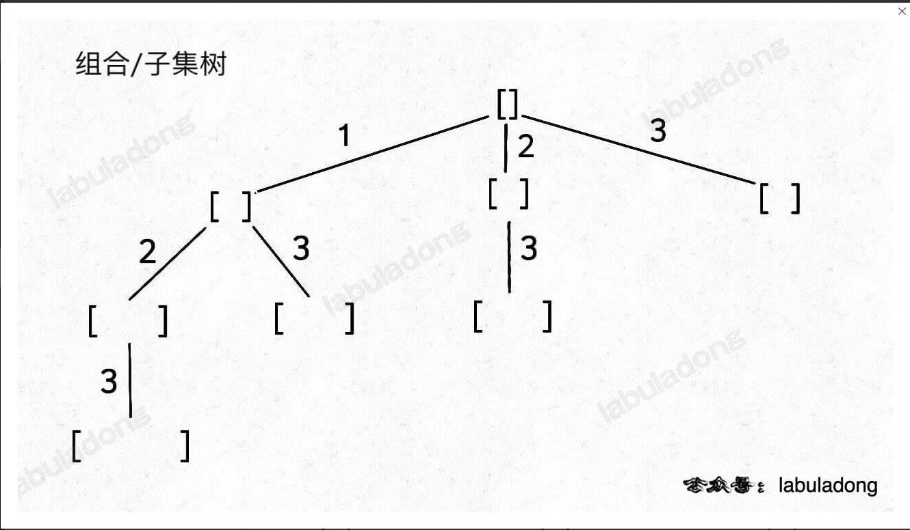
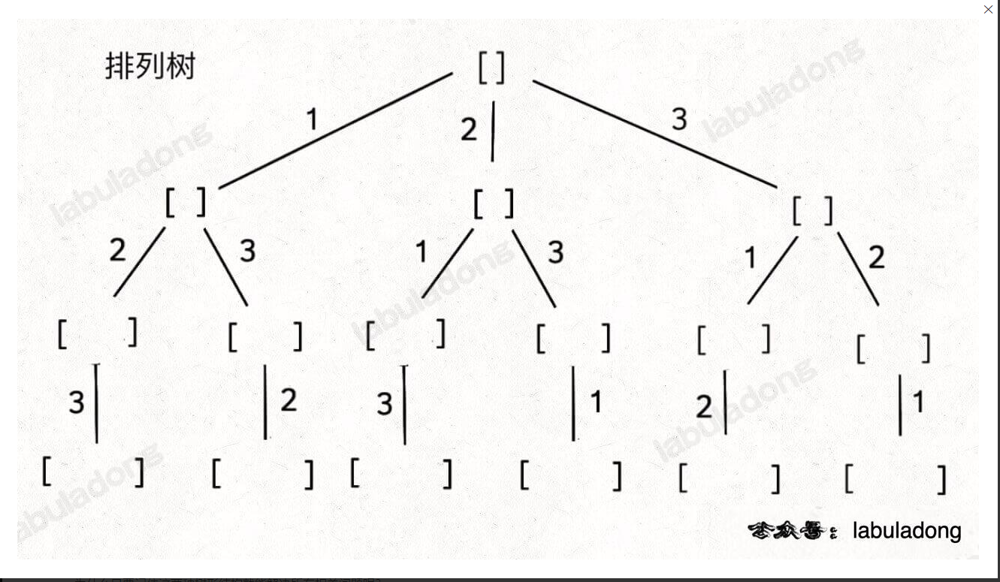

大纲

先判断问题类型，选择不同回溯树模板，画出问题的回溯树，选择对应的回溯模板代码，修改部分细节，解决问题

## 问题类型
### 类型
- 子集
- 组合
- 排列
### 给出数据的要求
- 不可重复 不可复选
- 可重复 不可复选
- 不可重复 可复选
- 可重复  可复选 (去重后，相当于上一种)

其中子集问题和组合问题求解方法一致，可以看作一种问题


## 回溯树模板




## 回溯代码模板

```java
List<List<Integer>> res = new LinkedList<>();
// 记录回溯算法的递归路径
LinkedList<Integer> track = new LinkedList<>();

// 主函数
public List<List<Integer>> combine(int n, int k) {
    backtrack(1, n, k);
    return res;
}

void backtrack(int start, int n, int k) {
    // base case

    
    // 回溯算法标准框架
    for (int i = start; i <= n; i++) {
        // 选择
        track.addLast(i);
        // 通过 start 参数控制树枝的遍历，避免产生重复的子集
        backtrack(i + 1, n, k); // i 等于1 就是层与层之间元素可以重复用
        // 撤销选择
        track.removeLast();
    }
}
```

## 全排列伪代码

```java
for 选择 in 选择列表:
    # 做选择
    将该选择从选择列表移除
    路径.add(选择)
    backtrack(路径, 选择列表)
    # 撤销选择
    路径.remove(选择)
    将该选择再加入选择列表

```
### 全排列代码模板

```java
List<List<Integer>> res = new LinkedList<>();

/* 主函数，输入一组不重复的数字，返回它们的全排列 */
List<List<Integer>> permute(int[] nums) {
    // 记录「路径」
    LinkedList<Integer> track = new LinkedList<>();
    // 「路径」中的元素会被标记为 true，避免重复使用
    boolean[] used = new boolean[nums.length];
    
    backtrack(nums, track, used);
    return res;
}

// 路径：记录在 track 中
// 选择列表：nums 中不存在于 track 的那些元素（used[i] 为 false）
// 结束条件：nums 中的元素全都在 track 中出现
void backtrack(int[] nums, LinkedList<Integer> track, boolean[] used) {
    // 触发结束条件

    
    for (int i = 0; i < nums.length; i++) {
        // 排除不合法的选择
        if (used[i]) {
            // nums[i] 已经在 track 中，跳过
            continue;
        }
        // 做选择
        track.add(nums[i]);
        used[i] = true;  //将该选择从结果集中移除
        // 进入下一层决策树
        backtrack(nums, track, used);
        // 取消选择
        track.removeLast();
        used[i] = false;  //将该选择加入结果集
    }
}


```