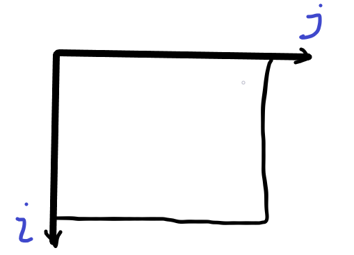
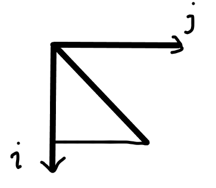
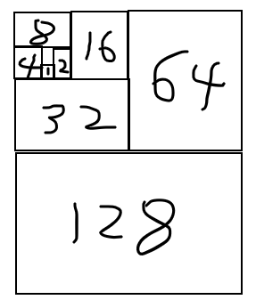

## 判断循环执行次数

### 级数

#### 算数级数

$$
T(n)= 1 + 2 + 3 + \cdots + n = n(n+1)/2 = O(n^2)
$$

算数级数的时间复杂度比第n次大一阶

#### 幂方级数

$$
T(n) = 1^2 + 2^2 + 3^2 + \cdots + n^2 =n(n+1)(2n+1) =  O(n^3)
$$

$$
T(n) = 1^3 + 2^3 + 3^3 + \cdots + n^3 = O(n^4)
$$

幂方级数的时间复杂度比第n次的复杂度大一阶

#### 几何级数

$$
T(n) = a^0 + a^1 + a^2 + a^3 + \cdots + a^n = O(a^n)
$$

几何级数的时间复杂度跟最大阶相同

#### 收敛级数

$$
T(n) = 1 + 1/2^2 + 1/2^3 + \cdots + 1/2^n = O(1)
$$

收敛级数的时间复杂度是O（1）

#### 未必收敛但长度有限

##### 调和级数

$$
T(n) = 1 + 1/2 + 1/3 + 1/4 + \cdots + 1/n = O(logN)
$$

##### 对数级数

$$
T(n) = log1 + log 2 + log 3 + \cdots + longN = log(n!) = O(NlogN)
$$

### 循环

tip：对于类似

```c
for(i = 0; i < n; i++)
	for(j = 0; j < n; j++)
```

**可以将 i 和 j 变量分别看作直角坐标系的横轴和纵轴，这个嵌套循环的复杂度就是下面这个面积**



tip：对于

```c
for(i = 0; i < n; i++)
	for(i = 0; i < i; j++)
```

**这个嵌套循环的复杂度就是这个面积**

**算数级数复杂度**



tip：对于

```c
for(i = 0; i < n; i <<= 1)  //意思为每次循环 i 都增大两倍
	for(j = 0; j < i; j++)
```

**这个嵌套循环复杂度类似于**

**几何级数复杂度**

