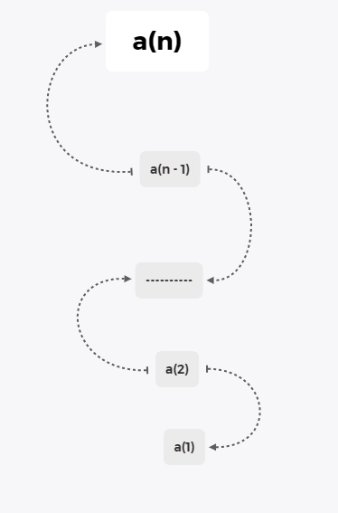

### 基本思想

#### 减而治之

- 分解为两个问题，一个平凡子问题，另一个是规模衰减的子问题
- 不断执行，直到两个问题都是平凡子问题后结束，合并结果

#### 分而治之

- 分解为两个规模相等的子问题
- 分别求解子问题，然后合并

### 分析递归过程的工具

- 递归跟踪分析(适用于线性递归)

  

- 递推方程

  类似于
  $$
  T(n) = T(n - 1) + O(1)
  T(0) = O(1)
  $$
  