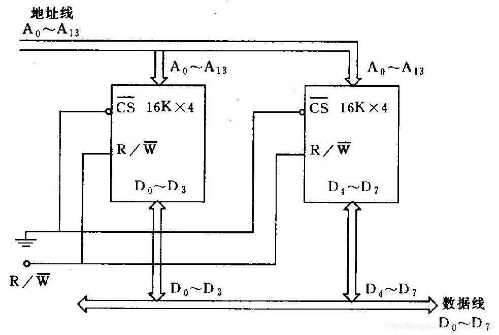
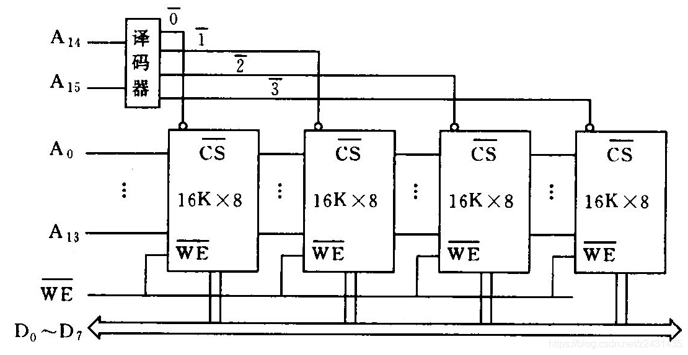

# 主存储器

## 类型

### RAM（随机存储器）

- 断电数据丢失
- 可以通过指令直接访问数据所在地址

### (ROM)非易失性半导体存储器

- 断电数据不消失

## 存储器属性

### 主存容量

- 指令地址码位数 32位最多支持4G内存

### 存储器读取时间

### 存储器读取周期

## 元器件类型

### RAM

- (SRAM)静态存储器

	- 利用触发器保存信息，不断电，信息就不会丢失
	- 集成度低，功耗大
	- 具体实现

- (DRAM)动态存储器

	- 利用MOS电容保存信息，需要不断给电容充电才能保存信息
	- 集成度高，功耗低，适合大容量存储器
	- 具体实现

### ROM

- 快擦除读写存储器(闪存)

	- 大存储量
	- 非易失性
	- 低价格
	- 高读写速度
	- 内存卡，u盘

## 存储器的组成与控制

### 存储器容量扩展

- 拓展的意义

	- 位拓展扩展访问一个地址能够获得的数据大小
	- 子拓展，拓展字的数量，就是更大的容量

- 控制端

	- cs（片选控制端）

		- 片选端决定一个元器件是否工作

	- R/W端(读写控制端)

		- 通过高低点评的选择控制读写操作

- 位扩展

  - 位扩展要求同时访问到两个芯片，所以要将片选端，读写控制端连到一起。
  - 地址线对应相连，保证输入一个地址，能访问到两个芯片中的对应位置
  - 数据线分为高位和地位，保证字长被拓展

  -  

- 字扩展

	- 字扩展要求所有的芯片能够被分别访问到，所以利用译码器，通过不同的信号控制片选端，来选择使哪个存储元器件工作。
	- 由于只进行了字的拓展，每次访问的都只是一个存储芯片，所需要的地址数保持不变，地址线对应串联
	- 将读写控制端连接到一起，使得读写控制能够同步。
	
	- 

*XMind - Trial Version*